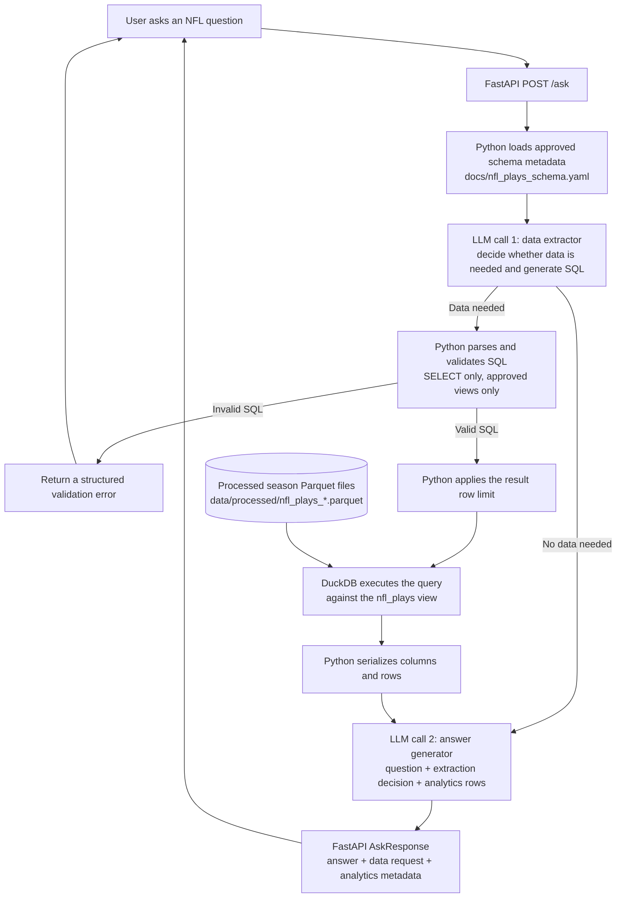

# Request Architecture

## Current Flow

The application currently uses two LLM calls. Schema loading, SQL validation,
query execution, and response serialization are deterministic application code.

## Component Responsibilities

| Component | Type | Responsibility |
| --- | --- | --- |
| FastAPI `/ask` | Python | Orchestrates the request and returns a structured response. |
| Schema metadata loader | Python | Converts `nfl_plays_schema.yaml` into an LLM-readable schema guide. |
| Data extractor | LLM call 1 | Decides whether local data is useful and generates one SQL query when needed. |
| SQL validator | Python | Allows a single read-only query against approved analytics views and blocks direct file access. |
| Row limiter | Python | Wraps valid SQL with the configured maximum result count. |
| DuckDB analytics layer | SQL engine | Creates `nfl_plays` over compatible season Parquet files and executes the query. |
| Answer generator | LLM call 2 | Synthesizes the question, extraction decision, and returned rows into a grounded answer. |

## Data Boundaries

The extractor receives the user question and the YAML schema guide. It does not
query Parquet files directly. Generated SQL must pass the application
guardrails before DuckDB can execute it.

The answer generator does not have database access. It receives the original
question, the extractor decision, and the bounded analytics result. If no local
data is needed, it receives the question and no analytics rows.

Invalid SQL is returned as a structured validation failure without calling the
answer generator. Provider or analytics initialization failures are returned as
service errors.

## Planned Evolution

After multiple datasets are available, the extraction step can be separated
into dataset selection and dataset-specific SQL generation. LangGraph should be
introduced only if the workflow gains useful branching, retries, or persistent
state that becomes difficult to manage with direct Python orchestration. See
`docs/roadmap.md` for the staged plan.
